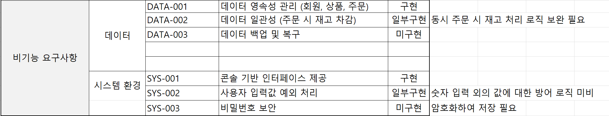
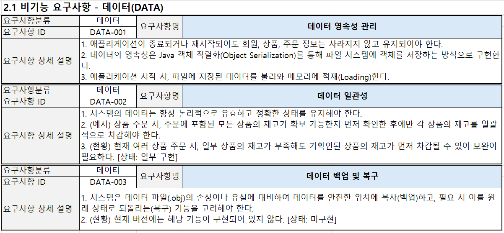

# 👨‍🌾 JikFarm (농산물 직거래 콘솔 애플리케이션)

<br>

## 📋 목차

1. [프로젝트 소개](#프로젝트-소개)
2. [프로젝트 기획](#프로젝트-기획)
   - [주제 선정 이유](#주제-선정-이유)
   - [프로젝트 기술적 특징](#프로젝트-기술적-특징)
3. [개발 환경 및 사용 기술](#개발-환경-및-사용-기술)
4. [패키지 구조 요약](#패키지-구조-요약)
   - [패키지별 역할 요약](#패키지별-역할-요약)
5. [주요 기능](#주요-기능)
6. [주요 기능 상세 분석](#주요-기능-상세-분석)
   - [회원 관리](#회원-관리)
   - [상품 관리](#상품-관리)
   - [장바구니 관리](#장바구니-관리)
   - [주문 관리](#주문-관리)
   - [관리자 기능](#관리자-기능)
7. [다이어그램](#다이어그램)
8. [유스케이스 다이어그램](#유스케이스-다이어그램-use-case-diagram)
9. [클래스 다이어그램](#클래스-다이어그램-class-diagram)
   - [전체 클래스 다이어그램](#전체-클래스-다이어그램)
   - [사용자 클래스 다이어그램](#사용자-클래스-다이어그램)
   - [상품 클래스 다이어그램](#상품-클래스-다이어그램)
   - [상품 주문 클래스 다이어그램](#상품-주문-클래스-다이어그램)
   - [상품 장바구니 클래스 다이어그램](#상품-장바구니-클래스-다이어그램)
   - [역할별 서비스 호출 구조](#역할별-서비스-호출-구조)
10. [액티비티 다이어그램](#액티비티-다이어그램)
    - [상품 주문](#상품-주문)
    - [상품 등록](#상품-등록)
11. [작동 시나리오](#작동-시나리오)

<br>

## 프로젝트 소개

JikFarm은 텍스트 기반의 콘솔 환경에서 동작하는 온라인 농산물 직거래 장터 애플리케이션입니다. 관리자와 일반 회원으로 역할을 분리하고, 상품 등록, 검색, 주문, 관리 등 온라인 쇼핑몰의 핵심 기능을 구현하며 객체 지향 프로그래밍과 계층형 아키텍처 설계를 학습하는 것을 목표로 합니다.

<br>

## 프로젝트 기획

## 주제 선정 이유

복잡한 유통 구조를 개선하는 **'농산물 직거래'**라는 현실적인 문제에 주목했습니다. 이 주제는 객체 지향 프로그래밍(OOP)과 계층형 아키텍처 등, 수업에서 배운 핵심적인 소프트웨어 공학 이론을 종합적으로 적용하고 심화 학습하기에 좋을 것 같다고 판단하여 프로젝트 주제로 선정했습니다.

단순한 기능 구현을 넘어, **배운 이론을 실제 코드에 녹여내고 설계 원칙을 체득하는 것**을 가장 큰 목표로 삼았습니다.

* **객체 지향 모델링 훈련:**
    생산자, 소비자, 상품, 주문 등 현실의 개념들을 `User`, `Product`, `Order`와 같은 **객체로 모델링**하고, 클래스 간의 관계를 설계하며 객체 지향 설계 원칙을 훈련했습니다.

* **계층형 아키텍처 적용:**
    사용자 인터페이스(App), 비즈니스 로직(Service), 데이터 관리(DAO)의 **역할을 명확히 분리**하는 3-Tier 아키텍처를 적용하여, 유지보수가 용이하고 유연한 코드 구조를 설계하는 방법을 학습했습니다.

* **설계 패턴의 실제적 구현:**
    특히 `Service`와 `DAO`를 **인터페이스 기반으로 설계**하고, **상속**을 통해 코드 재사용성을 높이는 등, 현업에서 중요하게 다루어지는 설계 패턴을 직접 구현해보는 데에 중점을 두었습니다.


## 프로젝트의 기술적 특징

* **인터페이스 기반의 유연한 설계:** Service와 DAO를 인터페이스로 추상화하여, 데이터 저장 방식을 파일에서 DB로 손쉽게 교체할 수 있는 '느슨한 결합(Loose Coupling)' 구조를 구현했습니다.
* **기능 중심의 패키지 구조:** 역할(Layer)이 아닌 기능(Feature: `product`, `user` 등) 단위로 패키지를 구성하여, 관련 코드의 응집도를 높이고 유지보수를 용이하게 만들었습니다.
* **상속을 통한 코드 재사용:** 메모리 기반 DAO(`HashMapDAO`)의 공통 로직을 파일 저장 DAO(`ObjFile...DAO`)가 상속받아, 중복 코드를 제거하고 핵심 기능에만 집중할 수 있도록 설계했습니다.
* **UML을 활용한 체계적인 문서화:** 요구사항부터 클래스, 액티비티 다이어그램까지 체계적인 설계를 통해 코드의 논리적 안정성을 확보하고, 프로젝트 전체 구조를 시각적으로 문서화했습니다.

<br>

## 개발 환경 및 사용 기술

* **언어:** Java (JDK 17)
* **IDE:** Eclipse
* **실행 방식:** Console 기반
* **데이터 저장:** Java 객체 직렬화(Serialization)를 이용한 파일 시스템
* **설계 및 문서화:** Visual Paradigm, PlantUML, Markdown

<br>

## 패키지 구조 요약

```text
📁 src (소스 루트)
 │
 ├─ 📁 app
 │  ├─ 📜 JikFarmConsoleApp.java (애플리케이션 실행 및 메뉴 제어)
 │  └─ 📜 MyAppReader.java (사용자 입력 처리)
 │
 ├─ 📁 cart
 │  ├─ 📜 CartDAO.java (장바구니 DAO 인터페이스)
 │  ├─ 📜 CartItemVO.java (장바구니 항목 데이터)
 │  ├─ 📜 CartService.java (장바구니 서비스 인터페이스)
 │  ├─ 📜 CartServiceImpl.java (장바구니 서비스 구현체)
 │  └─ 📜 HashMapCartDAO.java (메모리 기반 DAO 구현체)
 │
 ├─ 📁 order
 │  ├─ 📜 OrderDAO.java (주문 DAO 인터페이스)
 │  ├─ 📜 OrderItemVO.java (주문 항목 데이터)
 │  ├─ 📜 OrderService.java (주문 서비스 인터페이스)
 │  ├─ 📜 OrderServiceImpl.java (주문 서비스 구현체)
 │  ├─ 📜 OrderVO.java (주문 데이터)
 │  └─ 📁 file
 │     └─ 📜 ObjFileHashMapOrderDAO.java (파일 저장 DAO 구현체)
 │
 ├─ 📁 product
 │  ├─ 📜 ProductDAO.java (상품 DAO 인터페이스)
 │  ├─ 📜 ProductService.java (상품 서비스 인터페이스)
 │  ├─ 📜 ProductVO.java (상품 데이터)
 │  ├─ 📜 JFProductService.java (상품 서비스 구현체)
 │  ├─ 📜 HashMapProductDAO.java (메모리 기반 DAO 구현체)
 │  ├─ 📜 ListProductDAO.java (리스트 기반 DAO 구현체 - *대체 가능*)
 │  └─ 📁 file
 │     ├─ 📜 FileProductDB.java (파일 DB 인터페이스)
 │     └─ 📜 ObjFileHashMapProductDAO.java (파일 저장 DAO 구현체)
 │
 └─ 📁 user
    ├─ 📜 UserDAO.java (사용자 DAO 인터페이스)
    ├─ 📜 UserService.java (사용자 서비스 인터페이스)
    ├─ 📜 UserVO.java (사용자 데이터)
    ├─ 📜 JFUserService.java (사용자 서비스 구현체)
    ├─ 📜 HashMapUserDAO.java (메모리 기반 DAO 구현체)
    └─ 📁 file
       ├─ 📜 FileUserDB.java (파일 DB 인터페이스)
       └─ 📜 ObjFileHashMapUserDAO.java (파일 저장 DAO 구현체)
```
<br>

### 패키지별 역할 요약

| 패키지 | 주요 역할 | 설명 |
| :--- | :--- | :--- |
| **`app`** | **실행 및 제어** | 사용자와의 상호작용, 즉 메뉴 표시와 입력 처리를 담당하는 최상위 계층입니다. |
| **`cart`** | **장바구니 기능** | 로그인 세션 동안만 유지되는 임시 장바구니 기능을 관리합니다. |
| **`order`** | **주문 기능** | 주문 생성, 내역 조회 등 주문과 관련된 모든 비즈니스 로직과 데이터를 담당합니다. |
| **`product`** | **상품 기능** | 상품 정보, 재고, 검색 등 상품과 관련된 모든 기능을 담당합니다. |
| **`user`** | **사용자 기능** | 회원가입, 로그인 등 사용자 정보 및 인증과 관련된 모든 기능을 담당합니다. |
| **`*.file`** | **데이터 영속성** | 각 기능별 DAO를 상속받아, 객체 데이터를 파일에 저장하고 불러오는 역할을 합니다. |

<br>

## 요구사항 정의서

### 기능 요구사항 정의서


<br>

### 비기능 요구사항 정의서



## 기능 요구사항 명세서

<br>

### 공통 요구사항 명세서


<br>

### 사용자 요구사항 명세서


<br>

### 관리자 요구사항 명세서


<br>

## 비기능 요구사항 명세서 

<br>

### 데이터 요구사항 명세서


<br>

### 시스템 요구사항 명세서


<br>

## 주요 기능

* **회원 관리:** 회원가입, 로그인/로그아웃, 내 정보 관리, 회원 탈퇴
* **상품 관리:** 상품 목록 조회, 이름 검색, 가격/이름순 정렬
* **주문 관리:** 상품 즉시 주문, 장바구니 일괄 주문, 주문 내역 조회
* **장바구니:** 장바구니 상품 추가, 조회, 삭제, 비우기
* **관리자 기능:** 전체 회원/주문 목록 조회, 상품 등록/수정/삭제

<br>

## **주요 기능 상세 분석**
---
### **회원 관리**

* **회원가입:** 사용자 정보를 입력받아 새로운 계정을 생성합니다. (`UserService.registUser()`)
* **로그인/로그아웃:** 아이디와 비밀번호로 시스템에 접속하고, 접속을 종료합니다. (`UserService.login()`,`logout()`)
* **내 정보 관리:** 로그인된 사용자가 자신의 비밀번호 등 개인 정보를 수정합니다. (`UserService.updatePassword()`)
* **회원 탈퇴:** 사용자가 본인 확인 후 서비스를 탈퇴합니다. (`UserService.removeUser()`)
  
---

### **상품 관리**

* **상품 목록 조회:** 판매 중인 모든 상품의 목록을 확인합니다. (`ProductService.listProducts()`)
* **이름 검색:** 특정 키워드가 포함된 상품명을 검색하여 목록을 필터링합니다. (`ProductService.searchProductsByName()`)
* **가격/이름순 정렬:** 전체 상품 목록을 가격순 또는 이름순으로 정렬하여 조회합니다. (`ProductService.listProducts(sortOption)`)
  
---

### **장바구니 관리**

* **장바구니 상품 추가:** 원하는 상품과 수량을 장바구니에 담습니다. (`CartService.addItemToCart()`)
* **장바구니 조회:** 현재 장바구니에 담긴 상품 목록과 총액을 확인합니다. (`CartService.listCartItems()`)
* **장바구니 삭제:** 장바구니에서 특정 상품을 제거합니다. (`CartService.removeCartItem()`)
* **장바구니 비우기:** 장바구니의 모든 상품을 한번에 비웁니다. (`CartService.clearCart()`)

---

### **주문 관리**

* **상품 즉시 주문:** 장바구니를 거치지 않고 상품 상세 화면에서 바로 주문합니다. (`OrderService.orderNow()`)
* **장바구니 일괄 주문:** 장바구니에 담긴 모든 상품을 한번에 주문합니다. (`OrderService.orderItems()`)
* **주문 내역 조회:** 자신의 과거 주문 기록을 조회합니다. (`OrderService.listMyOrders()`)

---

### **관리자 기능**

* **전체 회원/주문 목록 조회:** 시스템에 가입된 모든 회원 정보와 발생한 모든 주문 내역을 일괄 확인합니다. (`UserService.listAllUsers()`, `OrderService.listAllOrders()`)
* **상품 등록/수정/삭제:** 새로운 상품을 추가하고, 기존 상품의 정보를 변경하며, 판매가 중단된 상품을 삭제합니다. (`ProductService.registProduct()`, `updateProduct...()`, `removeProduct()`)

---
<br>

## 다이어그램

## 1. 유스케이스 다이어그램 (Use Case Diagram)

* 시스템의 전체적인 기능과 사용자의 상호작용을 나타냅니다.

    

<br>

---

## 2. 클래스 다이어그램

본 프로젝트의 주요 도메인 구조를 시각화한 클래스 다이어그램입니다.  
VO/DAO/Service 계층이 분리되어 있으며, 각 책임이 정의되어 있습니다.

## 전체 클래스 다이어그램 
   

   

### 사용자 클래스 다이어그램

<br>

   

* `UserService` 인터페이스에 회원가입, 로그인, 정보 수정 등 사용자 관련 기능의 명세를 정의합니다.
* `UserVO` 클래스를 사용하여 아이디, 이름, 주소 등 회원 정보를 하나의 단위로 묶어 계층 간에 전달합니다.
* `JFUserService` 구현 클래스에서 실제 비즈니스 로직을 처리하며, `UserDAO`를 통해 데이터에 접근합니다.
* `ObjFileHashMapUserDAO`를 통해 프로그램이 종료되어도 회원 정보가 유지되도록 파일에 영구적으로 저장합니다.


### 상품 클래스 다이어그램

<br>

   
   
* 관리자의 상품 등록/수정/삭제 및 사용자의 상품 조회 기능을 `ProductService` 인터페이스에 정의합니다.
* `ProductVO` 클래스를 사용하여 상품 번호, 이름, 가격, 재고 등 상품 데이터를 관리합니다.
* `JFProductService`가 실제 로직을 담당하며, `ObjFileHashMapProductDAO`를 통해 상품 정보를 파일 시스템에 저장하여 관리합니다.


### 상품 주문 클래스 다이어그램

<br>

   

* `OrderVO`(주문 대표 정보)와 `OrderItemVO`(주문 상품 목록)를 통해 하나의 주문에 여러 상품이 포함되는 복합적인 데이터를 구조화합니다.
* `OrderService` 인터페이스에 주문 생성, 내 주문 목록 조회 등의 기능을 정의합니다.
* `OrderServiceImpl`은 주문 생성 시 `ProductService`와 연동하여 상품 재고를 차감하는 등 여러 서비스에 걸친 로직을 처리합니다.
* 주문 내역은 중요한 영구 데이터이므로, `ObjFileHashMapOrderDAO`를 통해 파일에 저장하여 보관합니다.


### 상품 장바구니 클래스 다이어그램

<br>

   
   
* 장바구니에 담긴 상품(`productNo`)과 수량(`quantity`)을 `CartItemVO` 객체로 표현합니다.
* `CartService` 인터페이스를 통해 상품 추가, 목록 조회, 개별 삭제, 전체 비우기 등의 기능을 제공합니다.
* 장바구니는 사용자가 접속해 있는 동안에만 유지되는 임시 정보이므로, `HashMapCartDAO`를 이용해 메모리에만 데이터를 저장합니다.

    

### 역할별 서비스 호출 구조

<br>

   

* 애플리케이션의 시작점인 `JikFarmConsoleApp`이 사용자의 역할(관리자/일반 회원)을 판단하여 서로 다른 메뉴(`controlAdminMenu`, `controlUserMenu`)를 호출하는 컨트롤러 역할을 합니다.
* __관리자(Admin)__는 상품, 회원, 주문 등 시스템의 모든 핵심 기능(`ProductService`, `UserService`, `OrderService`)에 접근하여 관리합니다.
*  __일반 회원(Member)__은 상품을 조회하고 자신의 주문 내역을 확인하는 등 허용된 서비스에만 접근하여 기능을 사용합니다.


---

## 3. 액티비티 다이어그램

<br>


### 상품 주문

   

  

### 상품 등록

   
    
  
<br>

---

## 작동 시나리오

신규 회원이 가입하여 상품을 주문하는 전체 과정에 대한 시나리오입니다.

| 단계 | 사용자 행동 (User Action) | 시스템 반응 (System Response) |
| :--- | :--- | :--- |
| **1** | `3. 회원 가입` 메뉴 선택 | 회원 가입 정보 입력 프롬프트 표시 |
| **2** | ID, PW, 이름 입력 | "회원 가입이 완료되었습니다." 메시지 표시 |
| **3** | `2. 로그인` 메뉴 선택 | ID, PW 입력 프롬프트 표시 |
| **4** | 가입한 ID, PW 입력 | 환영 메시지와 함께 회원 전용 메뉴 표시 |
| **5** | `1. 상품 목록` 선택 후 검색어로 '사과' 입력 | '꿀사과'가 포함된 목록 표시 |
| **6** | `4. 장바구니 상품 담기` 선택 후 상품번호 '111', 수량 '2' 입력 | "장바구니에 추가했습니다." 메시지 표시 |
| **7** | `5. 장바구니 보기` 선택 후 `1. 상품 주문` 선택 | 배송 정보 입력 프롬프트 표시 (첫 주문이므로) |
| **8** | 연락처, 주소 등 배송 정보 입력 | "주문이 완료되었습니다." 메시지 표시 |
| **9** | `0. 로그아웃` 선택 | 로그아웃 메시지 표시 후 초기 메뉴로 복귀 |


  
